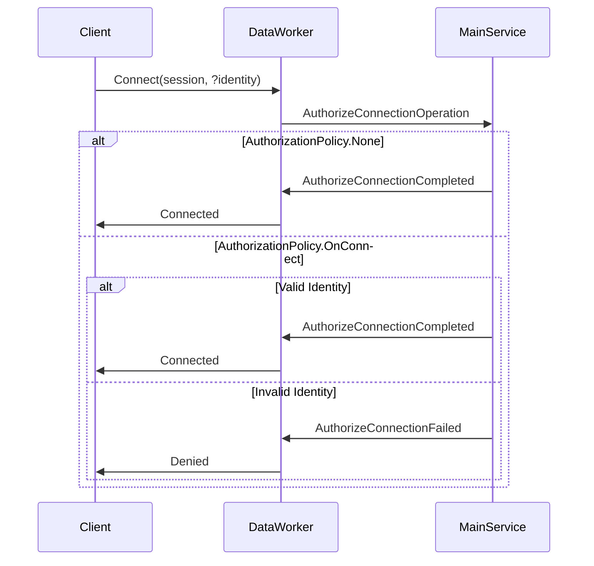
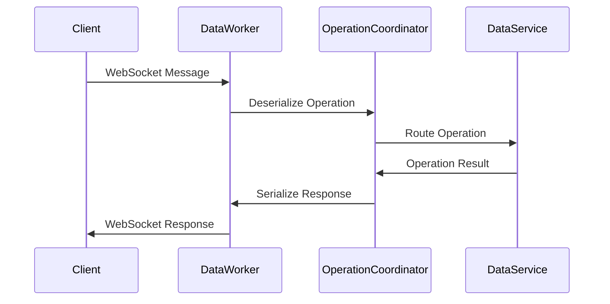
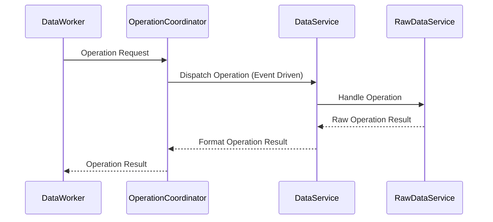

# Mod Data Layer Documentation

## Overview

The Mod Data Layer is a WebSocket-based system for real-time data operations, authentication, and session management, using a message-based architecture to serialize operations and send responses efficiently.

## Core Components

### 1. DataWorker

The DataWorker is the main entry point that handles the WebSocket lifecycle and messages processing.

#### Responsibilities

- Handles connection authentication/authorization
- Processes incoming messages
- Manages client sessions
- Sends responses back to clients

#### Authentication Flow



#### Message Flow



#### Key Methods

- `handleAuthorize()`: Validates incoming connections and handles authentication
- `handleConnect()`: Manages new WebSocket connections
- `handleMessage()`: Processes incoming WebSocket messages
- `handleDisconnect()`: Handles connection termination

### 2. Operation Coordinator

The Operation Coordinator orchestrates and manages the lifecycle of data operations.

#### Responsibilities

- Handles operation serialization/deserialization
- Message size management (splits large payloads > 63KB)
- Routes operations to appropriate services (`dataService` associated to the operation)
- Transaction coordination across multiple services
- Operation completion tracking
- Coordinates responses back to clients

#### Operation Flow



### 3. Data Operations

Data operations represent atomic units of work, ensuring that each operation is either fully executed or not executed at all, with no intermediate states visible.

#### Types

1. Basic Operations:

    - `CreateOperation`: Create new resources
    - `ReadOperation`: Query existing resources
    - `UpdateOperation`: Modify existing resources
    - `DeleteOperation`: Remove resources

2. Session Operations:
    - `AuthorizeConnectionOperation`:  Initial authorization request carrying identity information to validate a client connection. Contains credentials and permissions scope. Initialize client session.
    - `ConnectOperation`: Establishes a new WebSocket connection after successful authorization. Update client session.
    - `DisconnectOperation`: Terminates a WebSocket connection. Cleans up client session.

#### Data Operation Object

```javascript
{
    id: string,              // Unique identifier
    type: OperationType,     // Operation type
    timeStamp: ,             // Operation timestamp ?? TBD
    clientId: string,        // WebSocket connection ID
    data: any,               // Operation payload
    criteria: Criteria,      // Query filters
    identity: Identity,      // User identity
    target: Object,          // Specifies which DataService should handle the operation
    context: Object          // Additional context
}
```

### 4. Data Transaction

Group multiple operations together as one atomic unit.

All operations must succeed or the entire transaction rolls back

#### Transaction Types

1. Basic Transaction Operations:

    - `CreateTransactionOperation`: Starts a new transaction
    - `AppendTransactionOperation`: Adds operations to an existing transaction
    - `CommitTransactionOperation`: Makes changes permanent
    - `RollbackTransactionOperation`: Undoes all changes
    - `PerformTransactionOperation`: Executes the transaction

### 5. Identity System

Manages authentication and authorization

#### Identity Object

```javascript
{
    applicationIdentifier: string,    // Client application ID
    applicationCredentials: string,   // Optional client secrets
    provider: string,                 // Auth provider (Google, AWS, etc)
    scope: Array<Query>               // Access permissions
}
```

#### Authorization Policy

- `OnConnect`: Validate identity at connection time
- `None`: Allow anonymous access
- `OnDemand`: Validate per-operation
- `OnFirstFetch`: Validate on first data access
